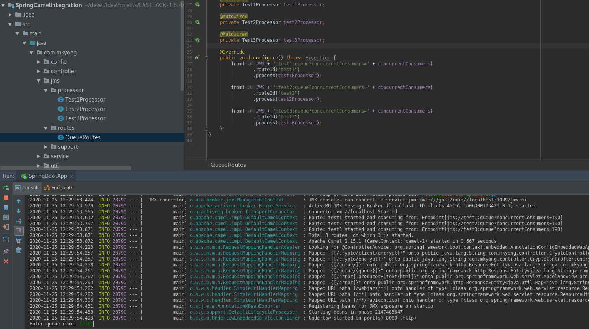
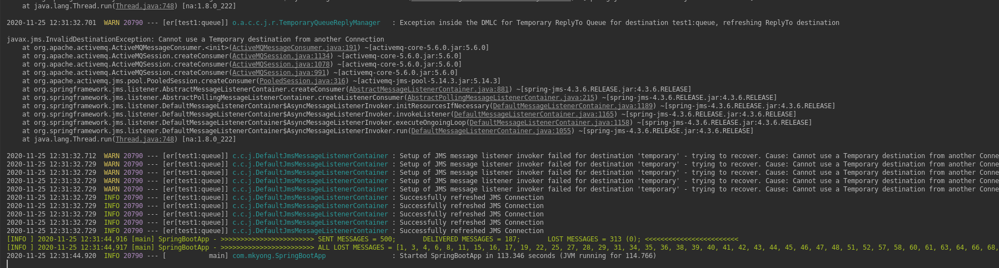

# apache camel exchangepattern timeToLive

* [Auto expiration of messages in Camel](https://stackoverflow.com/questions/8871249/auto-expiration-of-messages-in-camel)

(Short Text)
```text
I would like to know if there is a way to automatically expire and clear-out messages sent to a queue after X period of time. Since the originating server (filling the queue) wont know if anyone is picking up the messages, I don't want my queue to grow until its so large that something crashes.

Alternatively you can also provide specific per destination policies if you don't want the expired messages to reach the ActiveMQ.DLQ queue.

I wanted 10 seconds.
10 minutes is an Qpid default setting of when the expired messages are cleared from the queues.
For example: you sent a message to the queue having expiration set to 10 seconds, so after 10 seconds the messages is expired by QPid and no consumer can consume it, but de-facto the message is delete bu QPid when the Removal Policy Threads kick in, and the default setting is that they kick in after 10 minutes.


Endpoint option timeToLive (http://camel.apache.org/jms.html) worked for me as a solution for the described problem, messages are removed from a queue after 300000 miliseconds.
For example: "activemq:Q.QUEUE?disableReplyTo=true&timeToLive=300000"

Setting header JMSExpiration, didn't cause removing message from a queue automatically in my case.
```
```text
Я хотел бы знать, есть ли способ автоматически истекать и очищать сообщения, отправленные в очередь после X периода времени. Поскольку исходный сервер (заполняющий очередь) не будет знать, забирает ли кто-нибудь сообщения, я не хочу, чтобы моя очередь увеличивалась до тех пор, пока она не станет настолько большой, что что-то выйдет из строя.

В качестве альтернативы вы также можете указать определенные политики для каждого пункта назначения, если вы не хотите, чтобы просроченные сообщения попадали в очередь ActiveMQ.DLQ.

Хотел 10 секунд.
10 минут - это настройка Qpid по умолчанию, когда просроченные сообщения удаляются из очередей.
Например: вы отправили сообщение в очередь с истечением срока действия, равным 10 секундам, поэтому через 10 секунд срок действия сообщения истекает QPid, и ни один потребитель не может его использовать, но де-факто сообщение удаляется bu QPid, когда потоки политики удаления запускаются в, и по умолчанию они срабатывают через 10 минут.


Параметр конечной точки timeToLive (http://camel.apache.org/jms.html) работал у меня как решение описанной проблемы, сообщения удаляются из очереди через 300000 миллисекунд.
Например: "activemq:Q.QUEUE?disableReplyTo=true&timeToLive=300000"

Установка заголовка JMSExpiration не приводила к автоматическому удалению сообщения из очереди в моем случае.
```
(Full Text)

```text
I have a system implementing Camel and ActiveMQ for communication between some servers.
I would like to know if there is a way to automatically expire and clear-out messages sent to a queue after X period of time. Since the originating server (filling the queue) wont know if anyone is picking up the messages, I don't want my queue to grow until its so large that something crashes.
Bonus karma points to someone who can help and provide the java dsl way to implement this feature.


Alternatively you can also provide specific per destination policies if you don't want the expired messages to reach the ActiveMQ.DLQ queue.

The only limitation of this way is that you cannot easily use wildcards as it is coded here (you can, but it'll need some adaptations by using JMS destination header in the camel route).

We try to let the producers to define the timeToLive (and force them as much as possible) but it is not always possible to force them to change their code, this to minimize the number of such routes.

Well the setJMSExpiration(long expiration):

is something you MUST not call when you are the client. See my talk on this a bit on the ActiveMQ forum.

In your message on the forum it looked as if you wanted 10 minute expiration but had instead set 10 seconds. ex. (10 * (60 * 1000)) vs (10 * 1000) 
I wanted 10 seconds. 10 minutes is an Qpid default setting of when the expired messages are cleared from the queues. For example: you sent a message to the queue having expiration set to 10 seconds, so after 10 seconds the messages is expired by QPid and no consumer can consume it, but de-facto the message is delete bu QPid when the Removal Policy Thread(s) kick in, and the default setting is that they kick in after 10 minutes
Ok, I misunderstood what you had posted there.


Endpoint option timeToLive (http://camel.apache.org/jms.html) worked for me as a solution for the described problem, messages are removed from a queue after 300000 miliseconds. e.g. "activemq:Q.QUEUE?disableReplyTo=true&timeToLive=300000"

Setting header JMSExpiration, didn't cause removing message from a queue automatically in my case. But this doc gave me a hint.
```
```text
У меня есть система, реализующая Camel и ActiveMQ для связи между некоторыми серверами.
Я хотел бы знать, есть ли способ автоматически истекать и очищать сообщения, отправленные в очередь после X периода времени. Поскольку исходный сервер (заполняющий очередь) не будет знать, забирает ли кто-нибудь сообщения, я не хочу, чтобы моя очередь увеличивалась до тех пор, пока она не станет настолько большой, что что-то выйдет из строя.
Бонусная карма указывает на кого-то, кто может помочь и предоставить способ java dsl для реализации этой функции.


В качестве альтернативы вы также можете указать определенные политики для каждого пункта назначения, если вы не хотите, чтобы просроченные сообщения попадали в очередь ActiveMQ.DLQ.

Единственное ограничение этого способа состоит в том, что вы не можете легко использовать подстановочные знаки, как они закодированы здесь (вы можете, но потребуется некоторая адаптация с использованием заголовка назначения JMS в маршруте верблюда).

Мы стараемся позволить производителям определять timeToLive (и заставлять их как можно больше), но не всегда возможно заставить их изменить свой код, чтобы минимизировать количество таких маршрутов.

Ну, setJMSExpiration (долгое истечение срока):

Вы НЕ ДОЛЖНЫ звонить, когда являетесь клиентом. См. Мой разговор об этом на форуме ActiveMQ.

В вашем сообщении на форуме было указано, что вы хотели истечь 10 минут, но вместо этого установили 10 секунд. напр. (10 * (60 * 1000)) против (10 * 1000)
Хотел 10 секунд. 10 минут - это настройка Qpid по умолчанию, когда просроченные сообщения удаляются из очередей. Например: вы отправили сообщение в очередь, срок действия которой установлен на 10 секунд, поэтому через 10 секунд срок действия сообщения истекает QPid, и ни один потребитель не может его использовать, но де-факто сообщение удаляется bu QPid, когда поток политики удаления ( s) срабатывают, и по умолчанию они срабатывают через 10 минут
Хорошо, я неправильно понял, что вы там разместили.


Параметр конечной точки timeToLive (http://camel.apache.org/jms.html) работал у меня как решение описанной проблемы, сообщения удаляются из очереди через 300000 миллисекунд. например "activemq: Q.QUEUE? disableReplyTo = true & timeToLive = 300000"

Установка заголовка JMSExpiration не приводила к автоматическому удалению сообщения из очереди в моем случае. Но этот документ подсказал мне.
```


## jms time to live example

* [Java Message Service by](https://www.oreilly.com/library/view/java-message-service/0596000685/re05.html)
* [JMS topic time to live](https://stackoverflow.com/questions/18507595/jms-topic-time-to-live)


* [http://localhost:8161](http://localhost:8161) **(** [http://localhost:8161/admin/queues.jsp](http://localhost:8161/admin/queues.jsp) **)**   admin | admin



